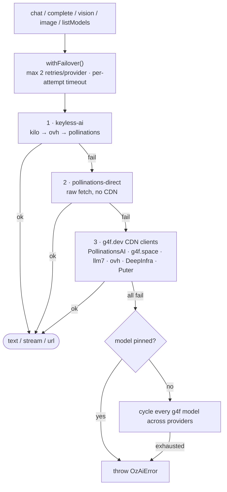

# @chirag127/oz-ai

> One keyless AI client for the whole oriz fleet — chat, complete, vision, image, and streaming with automatic multi-provider failover and no API key.

[](./LICENSE)
[](https://www.npmjs.com/package/@chirag127/oz-ai)
[](https://github.com/chirag127/oz-ai/stargazers)
[](https://github.com/chirag127/oz-ai/commits/main)
[](https://www.typescriptlang.org/)

## What it is / why it exists

Every site in the oriz fleet needs to call an LLM, but sprinkling API keys and provider-specific glue into ~80 apps is a maintenance and secrets nightmare. `oz-ai` is a single **framework-agnostic TypeScript client** with a built-in **keyless** failover chain: it tries `@chirag127/keyless-ai` first (kilo → ovh → pollinations), then a direct Pollinations `fetch`, then `@gpt4free/g4f.dev` CDN clients as an extended tail. The provider strategy lives in **one place** — change it here and every consumer inherits it. If everything fails it throws `OzAiError` so callers can degrade gracefully instead of crashing.

**npm:** [npmjs.com/package/@chirag127/oz-ai](https://www.npmjs.com/package/@chirag127/oz-ai) · **Landing:** [chirag127.github.io/oz-ai](https://chirag127.github.io/oz-ai/) · **Repo:** [github.com/chirag127/oz-ai](https://github.com/chirag127/oz-ai)

⭐ If this is useful, please **star the repo** — it helps others find it.

## How the failover works



Each provider gets up to 2 attempts (exponential backoff) before moving on. If no model was pinned and every provider fails on the default model, it walks the entire discovered model space before giving up. SSE streams have a per-chunk idle watchdog so a stalled stream fails over instead of hanging.

## Features

- **Keyless** — no API key required; the default chain uses free/keyless backends.
- **Ordered failover** — keyless-ai → direct Pollinations → g4f.dev CDN, reorderable in one file.
- **Node + browser** — the g4f.dev client is fetched from a CDN URL at runtime, so bundlers don't choke on a bare specifier.
- **Streaming** — `stream: true` returns an async-iterable of text chunks, with failover across providers.
- **Vision** — answer over an image (data URL or http URL); non-vision providers are skipped automatically.
- **Image generation** — returns an image URL (default `flux`).
- **`AbortSignal`** support throughout, plus per-attempt and stream-idle timeouts.
- **Graceful failure** — throws `OzAiError` only after all providers (and models) are exhausted.
- **Pure, testable helpers** exported for payload building and response extraction.

## Tech stack

- **TypeScript 5**, ESM-only, built with **tsup** (emits `dist/index.js` + `.d.ts`).
- Deps: **`@chirag127/keyless-ai`** (primary keyless backend) and **`@gpt4free/g4f.dev`** (extended failover tail).
- Tested with **vitest**.

## Install

```sh
npm i @chirag127/oz-ai
```

## Usage

```ts
import { chat, complete, vision, image, listModels, setProviders, OzAiError } from '@chirag127/oz-ai'

// one-shot completion (optional system prompt)
const answer = await complete('Summarize photosynthesis', { system: 'Be terse.' })

// multi-turn chat
const reply = await chat([
  { role: 'system', content: 'You are helpful.' },
  { role: 'user', content: 'Hello' },
])

// streaming — async-iterable of text chunks
const stream = await chat([{ role: 'user', content: 'write a haiku' }], { stream: true })
for await (const chunk of stream) process.stdout.write(chunk)

// vision (data URL or http url)
const desc = await vision('What is in this image?', dataUrl)

// image generation → url
const url = await image('a white siamese cat', { model: 'flux' })

// every model id across all providers ([] on total failure — never throws)
const models = await listModels()

// override / reset the failover chain (tests, custom order)
setProviders(null)

// degrade gracefully
try {
  await complete('...')
} catch (e) {
  if (e instanceof OzAiError) render('AI unavailable')
}
```

## API reference

| Fn | Signature |
|---|---|
| `chat` | `(messages, { model?, signal?, temperature? }) => Promise<string>` · with `{ stream: true }` → `Promise<AsyncIterable<string>>` |
| `complete` | `(prompt, { system?, model?, signal?, temperature? }) => Promise<string>` |
| `vision` | `(prompt, imageDataUrl, { model?, signal? }) => Promise<string>` |
| `image` | `(prompt, { model?, signal? }) => Promise<string>` (image url) |
| `listModels` | `(signal?) => Promise<string[]>` — never throws; `[]` on total failure |
| `setProviders` | `(Provider[] \| null) => void` — override or reset the failover chain |

Also exports pure helpers `buildPayload`, `buildVisionMessages`, `extractContent`, `extractDelta`, `extractImageUrl`, `modelId`, and types `Message`, `ContentPart`, `ChatOptions`, `RequestPayload`, `Provider`, plus the `OzAiError` class.

## Configuration

Optional tuning via environment variables (Node):

| Variable | Purpose |
| --- | --- |
| `OZ_AI_ATTEMPT_TIMEOUT_MS` | Per-attempt timeout before failing over (default 30000) |
| `OZ_AI_STREAM_IDLE_TIMEOUT_MS` | Abort a stream if no chunk arrives within this window (default 30000) |

## Repo structure

```
src/
  index.ts          # failover chain, chat/complete/vision/image/listModels, streaming
  payload.ts        # pure helpers: buildPayload, extractContent/Delta/ImageUrl, modelId
  keyless-ai.d.ts   # types for @chirag127/keyless-ai
  *.test.ts         # vitest: failover + payload
tsup.config.ts      # ESM build → dist
docs/index.html     # GitHub Pages landing → redirects to npm
```

## Part of the oriz family

`oz-ai` is the shared AI client used across ~80 sites and tools in the **oriz** family. See the rest at [blog.oriz.in](https://blog.oriz.in).

## Contributing

Issues and PRs welcome. To change the fleet's provider strategy, edit the `providers()` chain in `src/index.ts` — one place, every consumer inherits it. Run `npm test` (vitest) before opening a PR.

## Status

Published and in active use across the fleet. Roadmap: more keyless backends in the chain and configurable per-call provider selection.

## License

[MIT](./LICENSE) © 2026 Chirag Singhal · [chirag@oriz.in](mailto:chirag@oriz.in)

_Conventional commits are the changelog._
